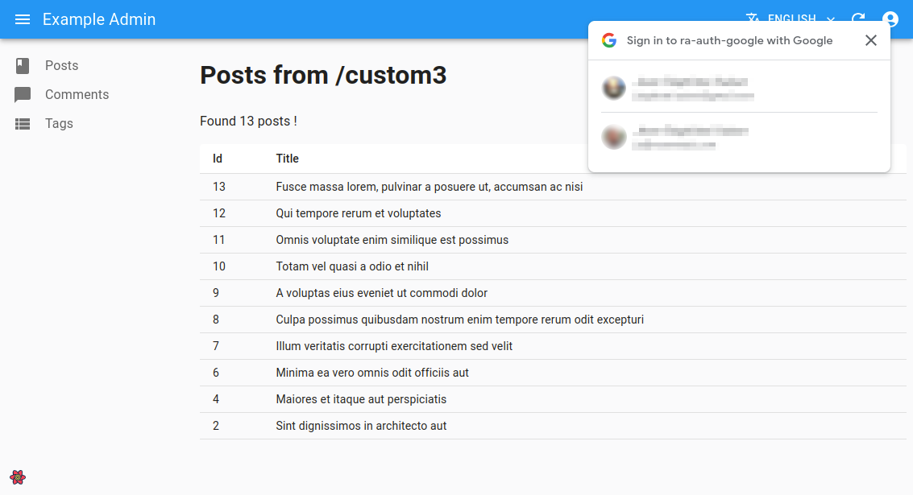
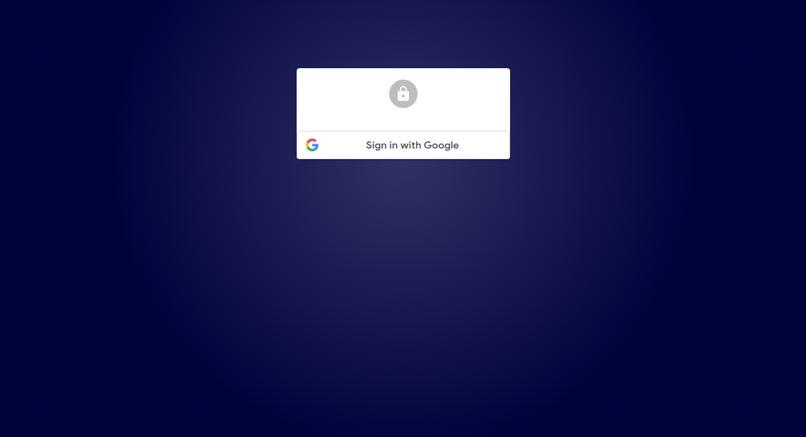
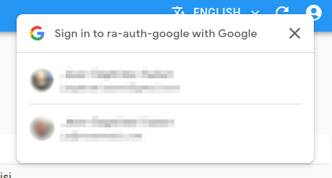
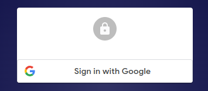

# ra-auth-google

An auth provider for [react-admin](https://github.com/marmelab/react-admin) that handles authentication using the [Google Identity Services (GIS)](https://developers.google.com/identity/gsi/web/guides/overview?hl=en).

It allows to easily enable users to sign to your app in using their Google account, either personal, or professional via [Google Workspaces](https://workspace.google.com/).



This package provides:

-   An `authProvider` to use with your react-admin app
-   A `<LoginButton>` component to render the [Sign in with Google button](https://developers.google.com/identity/gsi/web/guides/offerings?hl=en#sign_in_with_google_button)
-   A `<OneTapButton>` component to enable the [One Tap](https://developers.google.com/identity/gsi/web/guides/offerings?hl=en#one_tap) feature on your website
-   An `httpClient` to make authenticated requests to your API
-   A helper hook called `getGoogleAuthProvider`, allowing to configure all of the above from a single configuration object
-   A helper component called `<GoogleAuthContextProvider>`, allowing to expose the GSI params to the children components like `<LoginButton>` and `<OneTapButton>`

## Supported Features

- [Sign In with Google for Web](https://developers.google.com/identity/gsi/web/guides/overview), including all supported (client-side) features
- [One Tap](https://developers.google.com/identity/gsi/web/guides/offerings?hl=en#one_tap)
- [Automatic sign-in](https://developers.google.com/identity/gsi/web/guides/offerings?hl=en#automatic_sign-in)
- [Sign in with Google button](https://developers.google.com/identity/gsi/web/guides/offerings?hl=en#sign_in_with_google_button) (popup mode - see [limitations](#limitations))
- [Revoking user consent](https://developers.google.com/identity/gsi/web/guides/offerings?hl=en#revoking_user_consent) (at logout)

The following features are not (yet) included in this [demo](#demo), but should also be supported:

- [Authorizing for Web](https://developers.google.com/identity/oauth2/web/guides/overview)
- Using the Google Identity Service JavaScript library [with the token model](https://developers.google.com/identity/oauth2/web/guides/use-token-model) to call a Google API
- Using the Google Identity Service JavaScript library [with the token model](https://developers.google.com/identity/oauth2/web/guides/use-token-model), along with the [Google API Client Library for JavaScript](https://github.com/google/google-api-javascript-client/blob/master/docs/samples.md#loading-an-api-and-making-a-request), to call a Google API
- Using the [Admin SDK API](https://developers.google.com/admin-sdk/reference-overview?hl=en) to retrieve all groups/roles of a user, to compute permissions

## Limitations

Since they would require a back-end, the following features are not supported by this package:

- Automatic [token refresh](https://developers.google.com/identity/oauth2/web/guides/use-code-model?hl=en#get_access_and_refresh_tokens)
- Sign in with Google button in [redirect mode](https://developers.google.com/identity/gsi/web/reference/js-reference?hl=en#login_uri)

It's up to you to implement these features in your back-end if you need them.

## Installation

```sh
yarn add ra-auth-google
# or
npm install --save ra-auth-google
```

## Basic Usage

The following example implements [Sign in with Google button](https://developers.google.com/identity/gsi/web/guides/offerings?hl=en#sign_in_with_google_button) in popup mode, using the client id configured in the `.env` file.

```sh
# in .env
VITE_GOOGLE_CLIENT_ID="my-application-client-id.apps.googleusercontent.com"
```

```html
<!-- in index.html -->
<!DOCTYPE html>
<html lang="en">
  <head>
    <!-- Add the following line to load the Google Identity Services library -->
    <script async defer src="https://accounts.google.com/gsi/client"></script>
  </head>
  <body>
    <!-- ... -->
  </body>
</html>
```

```tsx
// in src/App.tsx
import React from "react";
import { Admin, Resource, Login } from "react-admin";
import {
    getGoogleAuthProvider,
    GoogleAuthContextProvider,
    LoginButton,
} from 'ra-auth-google';
import dataProvider from "./dataProvider";
import posts from "./posts";

const App = () => {
  const { authProvider, gsiParams } = getGoogleAuthProvider();

  const LoginPage = () => (
    <Login>
      <LoginButton theme="filled_black" />
    </Login>
  );

  return (
    // Wrap your Admin with GoogleAuthContextProvider to expose the gsiParams to the children components
    <GoogleAuthContextProvider value={gsiParams}>
      <Admin
        authProvider={authProvider}
        dataProvider={dataProvider}
        title="Example Admin"
        loginPage={LoginPage}
      >
        <Resource name="posts" {...posts} />
      </Admin>
    </GoogleAuthContextProvider>
  );
};
export default App;
```

**Tip:** This example uses the [`<Login>`](https://marmelab.com/react-admin/Authentication.html#customizing-the-login-component) component provided by react-admin to create the login page. You can also include the `<LoginButton>` component in your own login page if you prefer.

**Tip:** Remember to wrap your `<Admin>` with `<GoogleAuthContextProvider>` to expose the `gsiParams` to the children components, like the `<LoginButton>`.



## Providing Client ID Via Props

You can also provide the client id via a prop instead of using the `.env` file.

```tsx
// in src/App.tsx
import React from 'react';
import { Admin, Resource, Login } from 'react-admin';
import {
    getGoogleAuthProvider,
    GoogleAuthContextProvider,
    LoginButton,
} from 'ra-auth-google';
import dataProvider from './dataProvider';
import posts from './posts';

const App = () => {
  const { authProvider, gsiParams } = getGoogleAuthProvider({
    client_id: "my-application-client-id.apps.googleusercontent.com",
  });

  const LoginPage = () => (
    <Login>
      <LoginButton />
    </Login>
  );

  return (
    <GoogleAuthContextProvider value={gsiParams}>
      <Admin
        authProvider={authProvider}
        dataProvider={dataProvider}
        title="Example Admin"
        loginPage={LoginPage}
      >
        <Resource name="posts" {...posts} />
      </Admin>
    </GoogleAuthContextProvider>
   );
};
export default App;
```

## One Tap Button

The `<OneTapButton>` component can be used to enable the [One Tap](https://developers.google.com/identity/gsi/web/guides/offerings?hl=en#one_tap) button on one or more pages.



It can be used as a standalone component, or to wrap a page.

```tsx
import { OneTapButton } from "ra-auth-google";

const Standalone = () => {
  return (
    <div>
      <OneTapButton />
      <h1>My Page</h1>
    </div>
  )
};

const Wrapper = () => {
  return (
    <OneTapButton>
      <div>
        <h1>My Page</h1>
      </div>
    </OneTapButton>
  )
};
```

**Tip:** Remember to wrap your `<Admin>` with `<GoogleAuthContextProvider>` to expose the `gsiParams` to the children components that need it, like the `<OneTapButton>`.

Here is a full example enabling the One Tap button on a custom route:

```tsx
// in src/App.tsx
import React from "react";
import { Admin, Resource, Login, CustomRoutes } from "react-admin";
import { Route } from "react-router-dom";
import { getGoogleAuthProvider, LoginButton, OneTapButton, GoogleAuthContextProvider } from "ra-auth-google";
import dataProvider from "./dataProvider";
import posts from "./posts";

const App = () => {
  const { authProvider, gsiParams } = getGoogleAuthProvider();

  const LoginPage = () => (
    <Login>
      <LoginButton />
    </Login>
  );

  return (
    <GoogleAuthContextProvider value={gsiParams}>
      <Admin
        authProvider={authProvider}
        dataProvider={dataProvider}
        title="Example Admin"
        loginPage={LoginPage}
      >
        <Resource name="posts" {...posts} />
        <CustomRoutes>
          <Route
            path="/custom"
            element={
              <div>
                <OneTapButton />
                <h1>My Page</h1>
              </div>
            }
          />
        </CustomRoutes>
      </Admin>
    </GoogleAuthContextProvider>
  );
};
export default App;
```

## Customizing The Sign In With Google Button

Google does not support using your own button to sign in. However, you can customize the button, using the [provided props](https://developers.google.com/identity/gsi/web/reference/js-reference?hl=en#GsiButtonConfiguration), to better integrate it with your app.



You can also use the [code generator](https://developers.google.com/identity/gsi/web/tools/configurator) to try out the different options.

For instance, here is how to use a black-filled button theme instead of the default one:

```tsx
// in src/App.tsx
import React from 'react';
import { Admin, Resource, Login } from 'react-admin';
import { getGoogleAuthProvider, LoginButton, GoogleAuthContextProvider } from "ra-auth-google";
import dataProvider from './dataProvider';
import posts from './posts';

const App = () => {
  const {
    authProvider,
    gsiParams,
  } = getGoogleAuthProvider();

  const LoginPage = () => (
    <Login>
      <LoginButton theme="filled_black" />
    </Login>
  );

  return (
    <GoogleAuthContextProvider value={gsiParams}>
      <Admin
        authProvider={authProvider}
        dataProvider={dataProvider}
        title="Example Admin"
        loginPage={LoginPage}
      >
        <Resource name="posts" {...posts} />
      </Admin>
    </GoogleAuthContextProvider>
   );
};
export default App;
```

## Automatic Sign-In

You can enable [Automatic sign-in](https://developers.google.com/identity/gsi/web/guides/offerings?hl=en#automatic_sign-in) by setting the [`auto_select`](https://developers.google.com/identity/gsi/web/reference/js-reference?hl=en#auto_select) param to `true`:

```tsx
// in src/App.tsx
import React from "react";
import { Admin, Resource, Login, CustomRoutes } from "react-admin";
import { Route } from "react-router-dom";
import { getGoogleAuthProvider, LoginButton, OneTapButton, GoogleAuthContextProvider } from "ra-auth-google";
import dataProvider from "./dataProvider";
import posts from "./posts";

const App = () => {
  const { authProvider, gsiParams } = getGoogleAuthProvider({
    auto_select: true,
  });

  const LoginPage = () => (
    <Login>
      <LoginButton />
    </Login>
  );

  return (
    <GoogleAuthContextProvider value={gsiParams}>
      <Admin
        authProvider={authProvider}
        dataProvider={dataProvider}
        title="Example Admin"
        loginPage={LoginPage}
      >
        <Resource name="posts" {...posts} />
        <CustomRoutes>
          <Route
            path="/custom"
            element={
              <div>
                <OneTapButton />
                <h1>My Page</h1>
              </div>
            }
          />
        </CustomRoutes>
      </Admin>
    </GoogleAuthContextProvider>
  );
};
export default App;
```

## Configuring The Google Identity Services Library

`getGoogleAuthProvider` accepts all the [parameters](https://developers.google.com/identity/gsi/web/reference/js-reference?hl=en#IdConfiguration) supported by the GIS library.

For example, to change the text of the title and messages in the One Tap prompt, use the [`context`](https://developers.google.com/identity/gsi/web/reference/js-reference?hl=en#context) parameter:

```tsx
// in src/App.tsx
import React from "react";
import { Admin, Resource, Login, CustomRoutes } from "react-admin";
import { Route } from "react-router-dom";
import { getGoogleAuthProvider, LoginButton, OneTapButton, GoogleAuthContextProvider } from "ra-auth-google";
import dataProvider from "./dataProvider";
import posts from "./posts";

const App = () => {
  const { authProvider, gsiParams } = getGoogleAuthProvider({
    context: "use",
  });

  const LoginPage = () => (
    <Login>
      <LoginButton />
    </Login>
  );

  return (
    <GoogleAuthContextProvider value={gsiParams}>
      <Admin
        authProvider={authProvider}
        dataProvider={dataProvider}
        title="Example Admin"
        loginPage={LoginPage}
      >
        <Resource name="posts" {...posts} />
        <CustomRoutes>
          <Route
            path="/custom"
            element={
              <div>
                <OneTapButton />
                <h1>My Page</h1>
              </div>
            }
          />
        </CustomRoutes>
      </Admin>
    </GoogleAuthContextProvider>
  );
};
export default App;
```

## Making Authenticated Requests To The API

`ra-auth-google` includes an `httpClient` that can be used to make authenticated requests to your API. This helper automatically adds the credentials `token` to the request headers.

Here is an example with `ra-data-json-server`:

```tsx
// in src/App.tsx
import { getGoogleAuthProvider, LoginButton, GoogleAuthContextProvider } from "ra-auth-google";
import jsonServerProvider from "ra-data-json-server";
import React from "react";
import { Admin, Login, Resource } from "react-admin";
import posts from "./posts";

const App = () => {
  const { authProvider, httpClient, gsiParams } = getGoogleAuthProvider();

  const dataProvider = jsonServerProvider(
    "https://jsonplaceholder.typicode.com",
    httpClient
  );

  const LoginPage = () => (
    <Login>
      <LoginButton />
    </Login>
  );

  return (
    <GoogleAuthContextProvider value={gsiParams}>
      <Admin
        authProvider={authProvider}
        dataProvider={dataProvider}
        title="Example Admin"
        loginPage={LoginPage}
      >
        <Resource name="posts" {...posts} />
      </Admin>
    </GoogleAuthContextProvider>
  );
};
export default App;
```

## Choosing The Token Storage Strategy

By default, `ra-auth-google` will store the received token in **localStorage**, under the `"token"` key.

If you want to store it somewhere else, or need to use a different key, you can provide your own `tokenStore`:

```tsx
// in src/myTokenStore.tsx
import { TokenStore } from "ra-auth-google";

export const myTokenStore: TokenStore = {
  getToken: () => localStorage.getItem("my_token"),
  setToken: (token) => localStorage.setItem("my_token", token),
  removeToken: () => localStorage.removeItem("my_token"),
};
```

```tsx
// in src/App.tsx
import { getGoogleAuthProvider, LoginButton, GoogleAuthContextProvider } from "ra-auth-google";
import jsonServerProvider from "ra-data-json-server";
import React from "react";
import { Admin, Login, Resource } from "react-admin";
import posts from "./posts";
import { myTokenStore } from "./myTokenStore";

const App = () => {
  const { authProvider, gsiParams, httpClient } = getGoogleAuthProvider({
    tokenStore: myTokenStore,
  });

  const dataProvider = jsonServerProvider(
    "https://jsonplaceholder.typicode.com",
    httpClient
  );

  const LoginPage = () => (
    <Login>
      <LoginButton />
    </Login>
  );

  return (
    <GoogleAuthContextProvider value={gsiParams}>
      <Admin
        authProvider={authProvider}
        dataProvider={dataProvider}
        title="Example Admin"
        loginPage={LoginPage}
      >
        <Resource name="posts" {...posts} />
      </Admin>
    </GoogleAuthContextProvider>
  );
};
export default App;
```

## API

### `getGoogleAuthProvider`

Use `getGoogleAuthProvider` to create an [authProvider](#googleauthprovider), an [`httpClient`](#googlehttpclient), and obtain a `gsiParams` object from a single configuration object.

The `gsiParams` can then be exposed to the children components using the `<GoogleAuthContextProvider>` wrapper.

```ts
const { authProvider, httpClient, gsiParams } = getGoogleAuthProvider();
```

It accepts the following parameters:

-   `client_id`: *Optional* - The Google API client ID of your application. Tries to use the `GOOGLE_CLIENT_ID` environment variable if not provided.
-   `tokenStore`: *Optional* - The token store to use to store the token. Defaults to `localStorageTokenStore`.
-   Other parameters: *Optional* - All the other parameters are passed to the Google Identity Services library. See the [documentation](https://developers.google.com/identity/gsi/web/reference/js-reference?hl=en#IdConfiguration) for the full list of supported parameters.

```ts
const { authProvider, httpClient, gsiParams } = getGoogleAuthProvider({
  client_id: "my-application-client-id.apps.googleusercontent.com",
  context: "use",
  tokenStore: myTokenStore,
});
```

### `googleAuthProvider`

Returns an authProvider that can be used with react-admin.

It accepts the following parameters:

-   `gsiParams`: **Required** - Parameters for the Google Identity Services library. See the [documentation](https://developers.google.com/identity/gsi/web/reference/js-reference?hl=en#IdConfiguration) for the full list of supported parameters.
-   `tokenStore`: *Optional* - The token store to use to store the token. Defaults to `localStorageTokenStore`.

```ts
const authProvider = googleAuthProvider({
  gsiParams: { 
    client_id: "my-application-client-id.apps.googleusercontent.com",
    ux_mode: "popup", 
  },
  tokenStore: myTokenStore,
});
```

### `<LoginButton>`

Returns a component that can be used to render the [Sign in with Google button](https://developers.google.com/identity/gsi/web/guides/offerings?hl=en#sign_in_with_google_button).

It requires to be used inside a `<GoogleAuthContextProvider>`.

It accepts the following props:

-   `sx`: *Optional* - Allows to customize the MUI `<Box>` inside which the button is rendered. See [MUI `sx` prop](https://mui.com/system/basics/#the-sx-prop) for more information.
-   Other parameters: *Optional* - All the other parameters are passed to the Sign in with Google button, and allow for customization. See the [documentation](https://developers.google.com/identity/gsi/web/reference/js-reference?hl=en#GsiButtonConfiguration) for the full list of supported parameters.

```tsx
const MyLoginButton = () => (
  <LoginButton
    theme="filled_black"
  />
);
```

### `<OneTapButton>`

The `<OneTapButton>` can be used either as a standalone component, or as a wrapper.

It requires to be used inside a `<GoogleAuthContextProvider>`.

The component itself doesn't render anything, but it triggers the Google API to display the One Tap prompt if the user is not yet signed in.

Use it in the pages that you want to enable the One Tap feature on.

```tsx
const Standalone = () => (
  <div>
    <OneTapButton />
    <h1>My Page</h1>
  </div>
);

const Wrapper = () => (
  <OneTapButton>
    <div>
      <h1>My Page</h1>
    </div>
  </OneTapButton>
);
```

### `googleHttpClient`

Returns an `httpClient` that can be used to make authenticated requests to your API.

It accepts the following parameters:

-   `tokenStore`: *Optional* - The token store to use to store the token. Defaults to `localStorageTokenStore`.

```ts
const httpClient = googleHttpClient({ tokenStore: myTokenStore });
```

### `<GoogleAuthContextProvider>`

A helper component that allows to expose the `gsiParams` to the children components like `<LoginButton>` and `<OneTapButton>`.

Use it to wrap your `<Admin>` component with the `gsiParams` obtained from `getGoogleAuthProvider`.

```tsx
// in src/App.tsx
import React from "react";
import { Admin, Resource } from "react-admin";
import {
    getGoogleAuthProvider,
    GoogleAuthContextProvider,
} from 'ra-auth-google';
import dataProvider from "./dataProvider";
import posts from "./posts";

const App = () => {
  const { authProvider, gsiParams } = getGoogleAuthProvider();

  return (
    <GoogleAuthContextProvider value={gsiParams}>
      <Admin
        authProvider={authProvider}
        dataProvider={dataProvider}
      >
        <Resource name="posts" {...posts} />
      </Admin>
    </GoogleAuthContextProvider>
  );
};
```

## Demo

You can find a working demo, along with the source code, in this project's repository: https://github.com/marmelab/ra-auth-google

## License

This auth provider is licensed under the MIT License and sponsored by [marmelab](https://marmelab.com).
